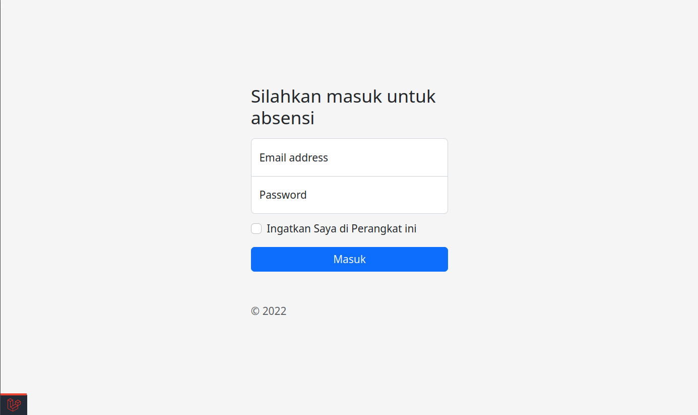
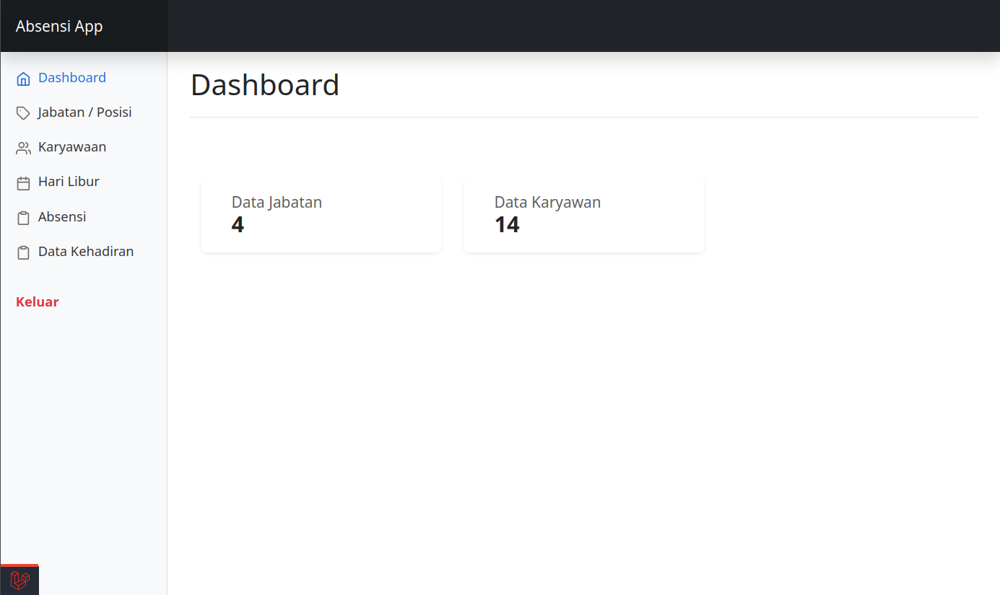
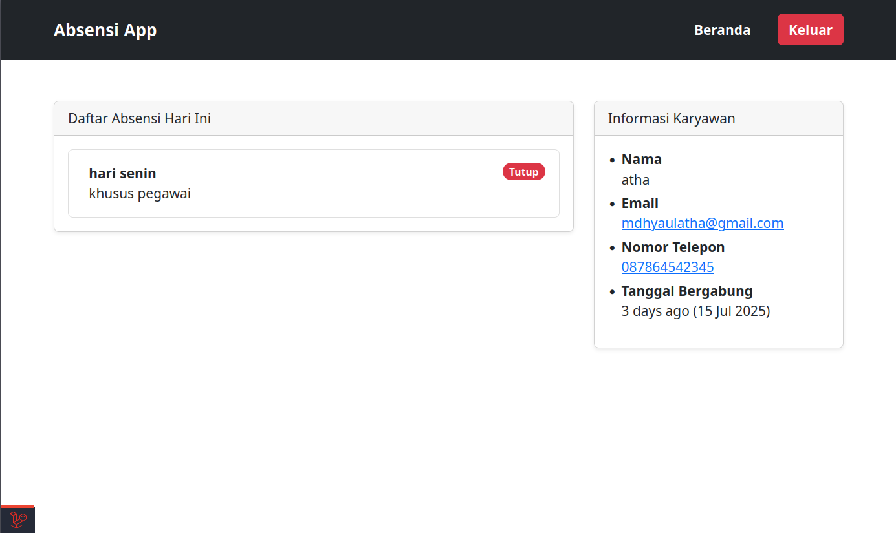

# Absensi App 

Aplikasi Absensi berbasis **Laravel 10** dengan fitur **absensi masuk dan pulang** menggunakan **QRCode** atau **input manual**, serta sistem manajemen pengguna dan kehadiran yang lengkap.

---

## 🖼️ Tampilan Aplikasi

Berikut beberapa cuplikan tampilan dari aplikasi:

| Halaman | Tampilan |
|--------|----------|
| **Login** |  |
| **Dashboard Admin** |  |
| **Dashboard Pengguna** |  |

> 

---

## ✨ Fitur Utama

- ✅ CRUD Jabatan / Posisi  
- ✅ Manajemen Pengguna (Admin, Operator, Pegawai)  
- ✅ CRUD Hari Libur  
- ✅ Sistem Absensi Masuk & Pulang (QR Code / Manual)  
- ✅ Riwayat Absensi 30 Hari Terakhir  
- ✅ Permintaan dan Persetujuan Izin  
- ✅ Laporan Karyawan Tidak Hadir  
- ✅ Export Laporan ke **Excel** & **CSV**  
- ✅ Role Based Access Control (RBAC)  
- ✅ Tabel interaktif dengan **Livewire PowerGrid**

---

## 🖥️ Deskripsi Aplikasi

**Absensi App** adalah solusi sistem informasi kehadiran karyawan berbasis web yang efisien dan mudah digunakan. Aplikasi ini dirancang untuk membantu perusahaan atau instansi dalam:

- **Mengelola kehadiran pegawai** secara real-time  
- **Memonitor karyawan yang absen, izin, atau terlambat**  
- **Menyediakan laporan yang dapat di-export** dengan mudah  
- **Mengatur hak akses berdasarkan peran** pengguna (admin/operator/pegawai)  
- **Mendukung dua metode absensi**: menggunakan QR Code dan input manual  
- Menyediakan **fitur izin dan konfirmasi izin** langsung oleh admin/operator  

---

## 🛠 Cara Instalasi di Localhost (Linux / Windows / Mac)

### ✅ Persyaratan

- PHP >= 8.1  
- Composer  
- Git  
- MySQL / MariaDB  

### 📥 Langkah Instalasi

```bash
# Clone repository
git clone https://github.com/Bangkah/ABSENSI-KARYAWAN.git
cd ABSENSI-KARYAWAN

# Install semua dependency
composer install

# Copy file environment
cp .env.example .env

# Ubah konfigurasi database di file .env:
# DB_DATABASE=absensi_karyawan
# DB_USERNAME=root
# DB_PASSWORD=

# Generate APP_KEY
php artisan key:generate

# Migrasi dan seeding database
php artisan migrate --seed

# Jalankan server lokal
php artisan serve
